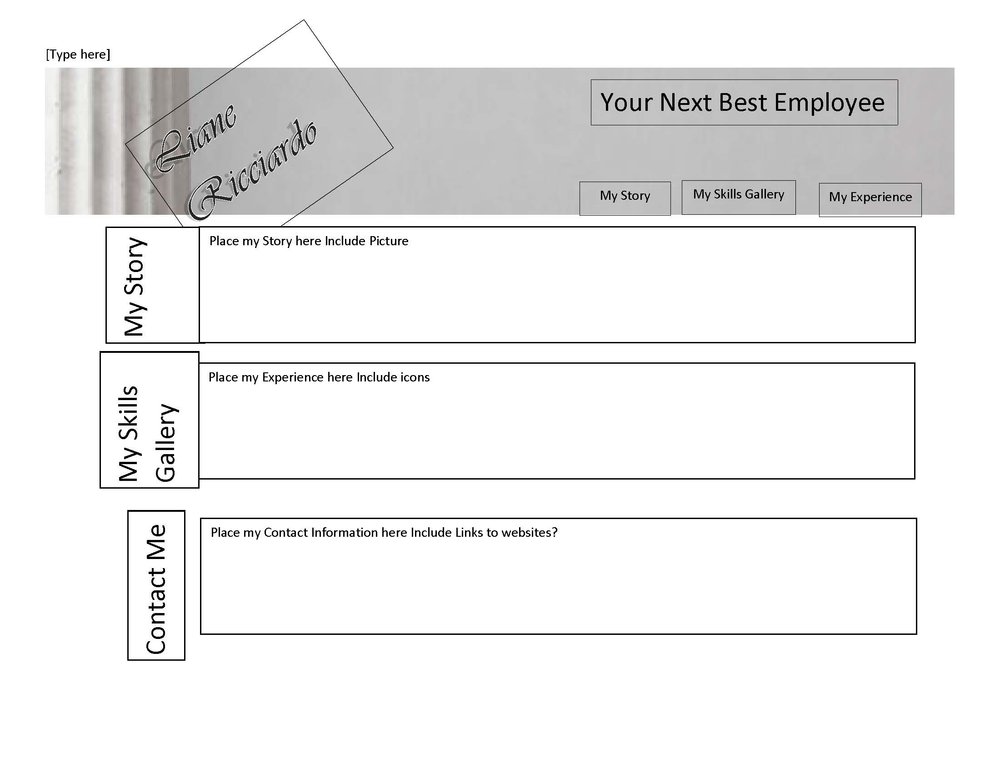

# Mod2-professional-portfolio

## An Online Resume/CA 

This is a online webpage to showcase some of online work and can be used with the intent of finding a job. A client or Employer can review the contents of this webpage an have an basic understanding of what are my skills.

Because I continually learn, this webpage can grow with me. Currently, It has three (3) selctions: My Story which relates who I am, My Skills Gallery which showcases my projects, and My Contact Information which will have my phone, email, website (when I get one), linkedin link and any other information I can give them.  I will also have for future an area for references (corporate not individual information will be shown).

I learned more about CSS Flexbox manipulations, jumping to areas in the web page without using scripted programming, and the GLOW!

Hope you enjoy!

## WireFrame

The following image was a wireframe prior to working on the webpage.  (Changes have been made.):



## Installation

No installation is required. 

## Usage

Provide instructions and examples for use. Include screenshots as needed.

To add a screenshot, create an `assets/images` folder in your repository and upload your screenshot to it. Then, using the relative filepath, add it to your README using the following syntax:

    ```md
    
    ```

## Credits

Although I had some help from classmates, this was a solo challenge and was completed as such. 

## License

Please refer to repository licenses.

---